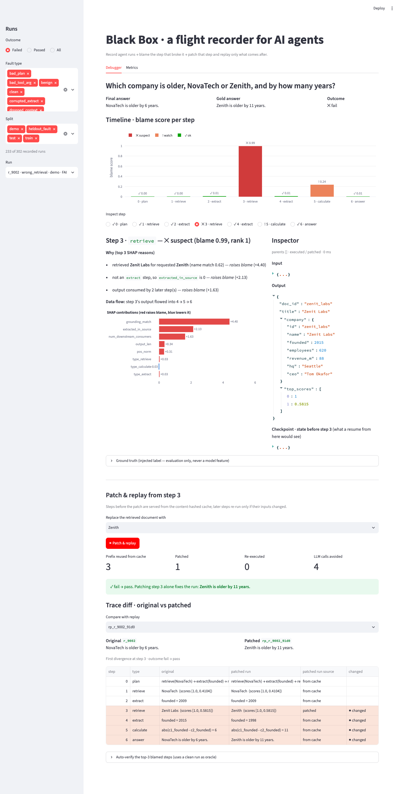
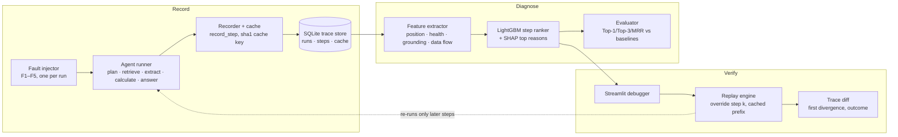
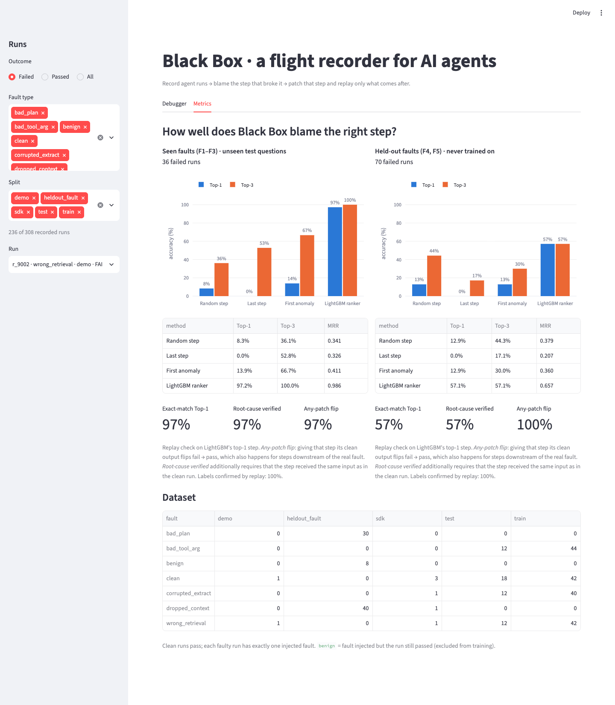

# Black Box: a flight recorder for AI agents

> Traces tell you *what* happened. Black Box tells you **which step to blame**, proves it by
> **replaying a fix**, and is scored on failures it has never seen.

An AI agent runs as a chain of steps (plan → retrieve → extract → calculate → answer). A run can
have six correct steps and still fail because one retrieval returned the wrong document, and the
wrong answer only shows up several steps later. Black Box:

1. **Records** every step (input, output, state snapshot, data-flow parents) into SQLite, with a
   content-hashed cache of every LLM and tool call.
2. **Diagnoses** the failing step with a trained LightGBM ranker. Every blame comes with SHAP
   reasons and the data-flow path from the blamed step to the answer.
3. **Verifies** the blame by patching that one step and replaying **only the steps after it**.
   Earlier steps come from cache, so a fix costs nothing for the unaffected prefix.



## Architecture



| Module | Role |
|---|---|
| `agent/` | `kb.json` (40 fictional companies with near-duplicate names), `questions.json` (60 questions, gold computed in Python), `tools.py`, `runner.py` |
| `blackbox/recorder.py` | `record_step()`, SQLite schema, cache (`sha1(type + prompt_version + model + canonical_json(input))`) |
| `blackbox/faults.py` | F1 wrong_retrieval, F2 bad_tool_arg, F3 corrupted_extract (train); F4 dropped_context, F5 bad_plan (held out) |
| `blackbox/generate.py` | 60 questions × (1 clean + 4 faulty) = 300 labelled runs |
| `blackbox/features.py`, `model.py` | Trace, calculation, and plan consistency features; LightGBM classifier, SHAP |
| `blackbox/replay.py` | `replay()`, `oracle_output()`, `verify_step()`, `resume_state()`, `diff()` |
| `blackbox/evaluate.py` | Top-1 / Top-3 / MRR, baselines, replay verification → `data/metrics.json` |
| `blackbox/live.py` | Random compatible fault injection from a selected clean run |
| `blackbox/demo.py` | The NovaTech vs Zenith pitch scenario (`r_9001` clean, `r_9002` faulty) |
| `blackbox/build.py` | One-command build of everything above; also run by the app on first launch |
| `blackbox/sdk.py` | `@blackbox.step` decorator: record **any** Python agent (see below) |
| `blackbox/cost.py` | Estimated LLM tokens and ₹/$ a suffix-only replay saves vs a full re-run |
| `examples/travel_agent.py` | A second agent in another domain, instrumented only with `@blackbox.step` |
| `app/streamlit_app.py` | Debugger UI |

## Run it

Python 3.11+. No GPU. No API key needed: without `GEMINI_API_KEY` the agent uses deterministic
rule-based planner and answer fallbacks, so everything runs offline and reproducibly.

```bash
python3.11 -m venv .venv
source .venv/bin/activate            # Windows: .venv\Scripts\activate
pip install -r requirements.txt

python -m blackbox.build             # dataset + model + metrics + demo runs (~7 s, offline)
streamlit run app/streamlit_app.py
```

`data/` is gitignored. If it's missing, the app builds it automatically on first launch.
`python -m blackbox.build --force` rebuilds from scratch. The individual steps are also available:
`python -m blackbox.generate`, `blackbox.model`, `blackbox.evaluate` and `blackbox.demo`.

### Node frontend API

FastAPI exposes the debugger and live demo as JSON endpoints. OpenAPI/Swagger UI and ReDoc are
generated automatically:

```bash
uvicorn api.main:app --reload --host 0.0.0.0 --port 8000
# Swagger UI: http://localhost:8000/docs
# OpenAPI JSON: http://localhost:8000/openapi.json
# ReDoc: http://localhost:8000/redoc
```

Set `BLACKBOX_CORS_ORIGINS` to a comma-separated list of frontend origins
(default: `http://localhost:3000,http://127.0.0.1:3000`). The main routes are:

| Area | Routes |
|---|---|
| Live demo | `GET /api/live-demo/clean-runs`, `POST /api/live-demo/injections` |
| Execute and diagnose | `GET /api/questions`, `POST /api/runs/execute`, `GET /api/runs`, `GET /api/runs/{run_id}`, `GET /api/runs/{run_id}/steps/{step_idx}` |
| Patch/replay | `POST /api/runs/{run_id}/replays`, `POST /api/runs/{run_id}/verify/{step_idx}`, `POST /api/runs/{run_id}/verify-top`, `GET /api/runs/{run_id}/oracle/{step_idx}` |
| Trace compare | `GET /api/runs/{run_id}/replays`, `GET /api/runs/{run_id}/diff/{other_run_id}`, `GET /api/runs/{run_id}/clean-reference`, `GET /api/runs/{run_id}/replay-savings/{replay_run_id}` |
| Other Streamlit data | `GET /api/dashboard`, `GET /api/metrics`, `GET /api/knowledge-base`, `GET /api/features`, `GET /api/health` |

Run requests accept a known `question_id`, or a custom question and gold answer so the result has
an explicit pass/fail criterion:

```json
{"question_id": "q001"}
```

Replay requests accept an `overrides` object keyed by step index, with each value being the
replacement step output. For example:

```json
{
  "overrides": {
    "3": {
      "doc_id": "zenith",
      "title": "Zenith",
      "company": {
        "id": "zenith",
        "name": "Zenith",
        "founded": 1998,
        "employees": 9800,
        "revenue_m": 1450,
        "hq": "Boston",
        "ceo": "Patricia Holt"
      },
      "top_scores": [0.8, 0.2]
    }
  }
}
```

Live injection accepts `{"clean_run_id": "..."}`; omit the ID to choose a random successful clean
run. The response includes the injected run, ranker ordering, per-step evidence, and a `caught_top1`
boolean. Live-demo traces use their own split and do not enter training or benchmark evaluation.

### Secrets and the optional LLM backend

```bash
cp .env.example .env                 # .env is gitignored; never commit it
pip install -r requirements-llm.txt  # adds google-genai
# then set GEMINI_API_KEY in .env
```

- `.env`, `.env.*` (except `.env.example`), `.streamlit/secrets.toml`, key and credential files,
  and `data/` are all in `.gitignore`.
- The cache key includes the backend (`rule-fallback` vs the Gemini model name), so cached
  offline outputs are never served as if an LLM had produced them.
- A placeholder value (`your_...`) counts as "no key".

### Deploy (Streamlit Community Cloud)

1. Push the repo (without `.env` or `data/`, both already gitignored).
2. Create an app with **Python 3.11** and main file `app/streamlit_app.py`.
3. Optional: add `GEMINI_API_KEY = "..."` under the app's *Secrets* (Streamlit exposes root-level
   secrets as environment variables) and switch the dependency file to `requirements-llm.txt`.
   Without it the app runs fully offline.
4. The first visit builds `data/` in a few seconds. Replays from all visitors share that SQLite
   file, which is rebuilt if the container restarts.

Usage statistics are switched off in `.streamlit/config.toml`.

### Tests

```bash
pip install -r requirements-dev.txt
python -m pytest -q                  # 53 tests
python -m scripts.test_stage5        # end-to-end demo checkpoint
python -m scripts.test_stage2        # cache checkpoint
```

`tests/test_core.py` runs against a throwaway SQLite DB, including a full build into a temp
directory. `tests/test_app.py` drives the UI headlessly with Streamlit's `AppTest`; it uses
`data/` and is skipped until that has been built.

## Instrument your own agent

Decorate each step; everything else (trace, cache, blame, patch & replay, diff) comes for free.

```python
import blackbox as bb

@bb.step("retrieve")
def retrieve(name: str) -> dict: ...          # return {"title": ..., "top_scores": [...], ...}

@bb.step("extract")
def extract(source: dict, field: str) -> dict: ...   # return {"value": ...}

@bb.step("answer", model="gemini-2.0-flash")   # model name goes into the cache key
def answer(question: str, total: float) -> dict: ...

def my_agent(question: str) -> str:
    doc = retrieve(...)
    bb.state()["hotel"] = extract(doc["source"], "hotel_per_night")["value"]   # optional fact store
    ...
    return answer(question, total)["answer"]

bb.register_agent("travel", my_agent)
bb.record("travel", "What is the total cost of 3 nights in Velora including the flight?",
          run_id="t_0001", gold="15000 rupees in total.")
```

- Outside `bb.record` the decorated functions are plain calls.
- Data-flow parents are inferred by value: an earlier step is a parent if one of its output
  values reappears in this step's input.
- `blackbox.replay.replay()` re-runs the registered agent, so patch & replay and auto-verify work
  in the UI too.

**Does the ranker transfer?** `examples/travel_agent.py` is a travel-budget agent with fictional
cities and near-duplicate names (Velora / Velara Bay). The ranker was trained **only** on the
company-facts agent. On the travel agent's three faulty runs it blames the right step every time,
and replay verifies each as the root cause:

| Run | Fault | Labelled step | Blamed step | Replay |
|---|---|---|---|---|
| `t_9102` | wrong retrieval | 1 | **1** (0.99) | fail → pass, root cause verified |
| `t_9104` | corrupted extract | 2 | **2** (0.98) | fail → pass, root cause verified |
| `t_9106` | dropped context (never trained on) | 3 | **3** (0.98) | fail → pass, root cause verified |

Run it with `python -m examples.travel_agent`. These are 3 runs, so this shows the idea works,
not a benchmark.

## What a replay saves

The replay panel shows how many estimated LLM tokens a suffix-only replay did **not** re-spend
compared with a full re-run, and the money that saves per 1,000 fixes. Tokens are estimated as
characters ÷ 4. Prices default to Gemini 2.0 Flash list prices ($0.10 / $0.40 per 1M
input/output tokens) and ₹88 per $; set `LLM_PRICE_IN_PER_M`, `LLM_PRICE_OUT_PER_M` and `USD_INR`
in `.env`.

On the demo run the fix reuses all 675 estimated LLM tokens (about ₹9 per 1,000 fixes). That's
small because this agent is tiny; the percentage is what carries over to larger agents.

## Results

Split by **question** (70/30) and by **fault type** (F4 and F5 never appear in training). Only
failed runs are scored; benign faults (where the run still passed) are excluded.

**Lead with root-cause verification:** after adding calculation and plan consistency, the rebuilt
model measured **100.0% on seen faults (36 runs; 95% Wilson CI 90.4–100.0%) / 92.9% on held-out
faults (70 runs; 95% Wilson CI 84.3–96.9%)**. This requires both a fail → pass patch and the same
input as the corresponding clean run. The Metrics tab also reports each fault type separately.

| Split | Method | Top-1 | Top-3 | MRR |
|---|---|---|---|---|
| **Seen faults (F1–F3), unseen test questions** (36 runs) | Random step | 8.3% | 36.1% | 0.341 |
| | Last step | 0.0% | 52.8% | 0.326 |
| | First anomaly | 13.9% | 66.7% | 0.411 |
| | **LightGBM ranker** | **100.0%** | **100.0%** | **1.000** |
| **Held-out faults (F4, F5), never trained on** (70 runs) | Random step | 12.9% | 44.3% | 0.379 |
| | Last step | 0.0% | 17.1% | 0.207 |
| | First anomaly | 12.9% | 30.0% | 0.360 |
| | **LightGBM ranker** | **92.9%** | **100.0%** | **0.964** |

Held-out by fault: **F4 dropped context 87.5% Top-1** (35/40; 95% CI 73.9–94.5%) and
**F5 bad plan 100.0% Top-1** (30/30; 95% CI 88.7–100.0%). Each seen fault group scored 12/12
Top-1; each small-group 95% CI is 75.8–100.0%.

**Replay verification** (patch the step with the clean run's output and replay):

| | Seen | Held-out |
|---|---|---|
| **Root-cause verified**: top-1 step got the same input as in the clean run, and patching it alone flips fail → pass | **100.0%** | **92.9%** |
| Exact-match Top-1 | 100.0% | 92.9% |
| Any-patch flip: patching the top-1 step flips fail → pass | 100.0% | 98.6% |
| Labels confirmed: patching the injected step flips fail → pass | 100% | 100% |



### Reading these numbers honestly

- **The seen-fault 100% comes from strong but legitimate grounding and consistency signals.**
  These include the name match between the requested and retrieved entity, whether an extracted
  value equals a value in the source document, and re-evaluation of recorded calculations.
  The seen faults are synthetic and these detectors catch them directly, so **the held-out row
  is the real generalisation number**.
- **Held-out is a split result, not an average skill.** F4 and F5 remain excluded from training.
  The feature set now checks arithmetic against recorded calculation inputs, checks plan
  operations against supported question templates, and checks planned actions against execution.
  These direct contradictions can elevate a step even when the classifier has not seen that fault
  type; F5 is localized at 30/30 and F4 at 35/40 in this rebuild. These counts have wide
  confidence intervals because each fault group is small.
- **"Any-patch flip" is not proof of root cause.** Giving any step downstream of the fault its
  clean output also fixes the run, which is why it is 100% on held-out faults even where the
  blame is wrong. We
  report the stricter *root-cause verified* metric next to exact-match accuracy, never on its own.
- **Leakage audit.** Features never read `fault_type`, `fault_step` or any injected flag. An
  earlier version of F1 stamped injected retrievals with `top_scores=[1.0, 0.0]` (a gap of exactly
  1.0, which never occurs naturally). That leaked the label and was removed: injected retrievals
  now keep the real retrieval scores.
- **Bug fixes that changed the numbers.** Earlier versions had 16/60 clean runs failing (calculator,
  planner and scoring bugs, which made those labels wrong). `extracted_in_source` used substring
  matching, so a zeroed value "0" was found inside "2009" and F4 was invisible. With these fixed,
  held-out Top-1 went from 0% to 27% to 57%.
- The 14.2% step accuracy reported on Who&When (below) was measured on a different and much harder
  benchmark (real multi-agent logs), so it is context for the problem, not a head-to-head
  comparison.

## Demo script (4 minutes)

1. **Problem (0:00–0:30).** Agents fail several steps after the real mistake. On the Who&When
   benchmark even strong LLM judges find the decisive step only about 14% of the time.
2. **The failed run (0:30–1:30).** Open `r_9002` (selected by default): *"Which company is older,
   NovaTech or Zenith?"* The agent answers "NovaTech is older by 6 years" (gold: "Zenith is
   older by 11 years"). The failure surfaces at step 6; nothing *looks* wrong earlier.
3. **Blame + evidence (1:30–2:15).** Step 3 (retrieve) is red at 0.99, and step 5 is orange.
   Reasons: retrieved **Zenit Labs** for requested **Zenith** (name match 0.62); the data flow
   is 3 → 4 → 5 → 6.
4. **Patch & replay (2:15–3:15).** Pick *Zenith* as the document and press **Patch & replay**:
   3 prefix steps reused from cache, 1 patched, 4 LLM-type steps served from cache, and the answer flips to
   "Zenith is older by 11 years". The diff shows the first divergence at step 3, fail → pass.
   Optionally open **Auto-verify** to show that a downstream step also flips but is *not* the
   root cause.
5. **Proof it generalises (3:15–4:00).** Metrics tab: baselines vs LightGBM on seen faults, then
   the held-out fault types the model never saw, then the primary root-cause-verified metrics and
   their per-fault confidence intervals.

### Live fault injection

Open **Live demo**, choose a successful clean run, and press **Inject random fault and rank it**.
Black Box picks a random eligible retrieve/extract/calculate step, injects a compatible fault,
records a separate `live_demo` run, then displays the ranker order and marks the injected step.
These runs do not enter training or evaluation. A particular injection can be benign for the final
answer; the tab makes that visible and lets the judge try another random injection.

**Likely questions.** *Synthetic data?* Yes, by design: injection gives exact ground truth (the
AgenTracer recipe), and held-out fault types test generalisation. *Would it work on my agent?*
The recorder is one wrapper per step, and the features are generic (grounding, data flow,
health). *Why LightGBM?* About 850 labelled steps, explanations needed, and it trains in
seconds on a laptop.

## Limitations

- One agent, one task domain, synthetic faults.
- Plan-intent checks currently support the built-in arithmetic question templates, not arbitrary
  natural-language planning tasks.
- Without an API key the agent runs on deterministic rule-based fallbacks, not an LLM. With a key,
  the plan, extract and answer steps call Gemini through the same recorder and cache.
- Replay verification needs an oracle (a clean run of the same question). In the UI, manual
  patches work without one.
- No LLM-as-judge baseline yet (it needs an API key).
- The second-agent transfer result is 3 runs: a demonstration, not a benchmark.
- Cost figures are estimates (characters ÷ 4, list prices), not billing data.

## References

- *Which Agent Causes Task Failures and When?* (Who&When), ICML 2025
- *Why Do Multi-Agent LLM Systems Fail?* (MAST), NeurIPS 2025
- *AgenTracer: Who Is Inducing Failure in the LLM Agentic Systems?*, ICLR 2026
- LangGraph docs: *Use time-travel*
