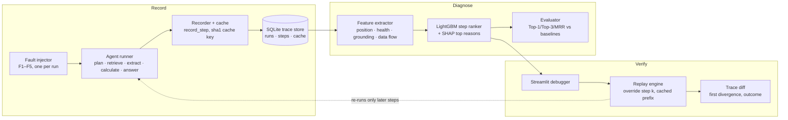

# Black Box: a flight recorder for AI agents

> Traces tell you *what* happened. Black Box tells you **which step to blame**, proves it by
> **replaying a fix**, and is scored on failures it has never seen.

An AI agent runs as a chain of steps (plan → retrieve → extract → calculate → answer). A run can
have six correct steps and still fail because one retrieval returned the wrong document, and the
wrong answer only shows up several steps later. Black Box:

1. **Records** every step (input, output, state snapshot, data-flow parents) into SQLite, with a
   content-hashed cache of every LLM and tool call.
2. **Diagnoses** the failing step with a trained LightGBM ranker. Every blame comes with SHAP
   reasons and the data-flow path from the blamed step to the answer.
3. **Verifies** the blame by patching that one step and replaying **only the steps after it**.
   Earlier steps come from cache, so a fix costs nothing for the unaffected prefix.


## Architecture



| Module | Role |
|---|---|
| `agent/` | `kb.json` (40 fictional companies with near-duplicate names), `questions.json` (60 questions, gold computed in Python), `tools.py`, `runner.py` |
| `blackbox/recorder.py` | `record_step()`, SQLite schema, cache (`sha1(type + prompt_version + model + canonical_json(input))`) |
| `blackbox/faults.py` | F1 wrong_retrieval, F2 bad_tool_arg, F3 corrupted_extract (train); F4 dropped_context, F5 bad_plan (held out) |
| `blackbox/generate.py` | 60 questions × (1 clean + 4 faulty) = 300 labelled runs |
| `blackbox/features.py`, `model.py` | 18 step features (no fault columns), LightGBM classifier, SHAP |
| `blackbox/replay.py` | `replay()`, `oracle_output()`, `verify_step()`, `resume_state()`, `diff()` |
| `blackbox/evaluate.py` | Top-1 / Top-3 / MRR, baselines, replay verification → `data/metrics.json` |
| `blackbox/demo.py` | The NovaTech vs Zenith pitch scenario (`r_9001` clean, `r_9002` faulty) |
| `blackbox/build.py` | One-command build of everything above; also run by the app on first launch |
| `app/streamlit_app.py` | Debugger UI |

## Run it

Python 3.11+. No GPU. No API key needed: without `GEMINI_API_KEY` the agent uses deterministic
rule-based planner and answer fallbacks, so everything runs offline and reproducibly.

```bash
python3.11 -m venv .venv
source .venv/bin/activate            # Windows: .venv\Scripts\activate
pip install -r requirements.txt

python -m blackbox.build             # dataset + model + metrics + demo runs (~7 s, offline)
streamlit run app/streamlit_app.py
```

`data/` is gitignored. If it's missing, the app builds it automatically on first launch.
`python -m blackbox.build --force` rebuilds from scratch. The individual steps are also available:
`python -m blackbox.generate`, `blackbox.model`, `blackbox.evaluate` and `blackbox.demo`.

### Secrets and the optional LLM backend

```bash
cp .env.example .env                 # .env is gitignored; never commit it
pip install -r requirements-llm.txt  # adds google-genai
# then set GEMINI_API_KEY in .env
```

- `.env`, `.env.*` (except `.env.example`), `.streamlit/secrets.toml`, key and credential files,
  and `data/` are all in `.gitignore`.
- The cache key includes the backend (`rule-fallback` vs the Gemini model name), so cached
  offline outputs are never served as if an LLM had produced them.
- A placeholder value (`your_...`) counts as "no key".

### Deploy (Streamlit Community Cloud)

1. Push the repo (without `.env` or `data/`, both already gitignored).
2. Create an app with **Python 3.11** and main file `app/streamlit_app.py`.
3. Optional: add `GEMINI_API_KEY = "..."` under the app's *Secrets* (Streamlit exposes root-level
   secrets as environment variables) and switch the dependency file to `requirements-llm.txt`.
   Without it the app runs fully offline.
4. The first visit builds `data/` in a few seconds. Replays from all visitors share that SQLite
   file, which is rebuilt if the container restarts.

Usage statistics are switched off in `.streamlit/config.toml`.

### Tests

```bash
pip install -r requirements-dev.txt
python -m pytest -q                  # 33 tests
python -m scripts.test_stage5        # end-to-end demo checkpoint
python -m scripts.test_stage2        # cache checkpoint
```

`tests/test_core.py` runs against a throwaway SQLite DB, including a full build into a temp
directory. `tests/test_app.py` drives the UI headlessly with Streamlit's `AppTest`; it uses
`data/` and is skipped until that has been built.

## Results

Split by **question** (70/30) and by **fault type** (F4 and F5 never appear in training). Only
failed runs are scored; benign faults (where the run still passed) are excluded.

| Split | Method | Top-1 | Top-3 | MRR |
|---|---|---|---|---|
| **Seen faults (F1–F3), unseen test questions** (36 runs) | Random step | 8.3% | 36.1% | 0.341 |
| | Last step | 0.0% | 52.8% | 0.326 |
| | First anomaly | 13.9% | 66.7% | 0.411 |
| | **LightGBM ranker** | **100.0%** | **100.0%** | **1.000** |
| **Held-out faults (F4, F5), never trained on** (70 runs) | Random step | 12.9% | 44.3% | 0.379 |
| | Last step | 0.0% | 17.1% | 0.207 |
| | First anomaly | 12.9% | 30.0% | 0.360 |
| | **LightGBM ranker** | **57.1%** | **57.1%** | **0.657** |

Held-out by fault type: **F4 dropped context 100%** Top-1 (40 runs), **F5 bad plan 0%**
(30 runs; the plan step is never in the top 3).

**Replay verification** (patch the step with the clean run's output and replay):

| | Seen | Held-out |
|---|---|---|
| Exact-match Top-1 | 100% | 57.1% |
| **Root-cause verified**: top-1 step got the same input as in the clean run, and patching it alone flips fail → pass | 100% | 57.1% |
| Any-patch flip: patching the top-1 step flips fail → pass | 100% | 100% |
| Labels confirmed: patching the injected step flips fail → pass | 100% | 100% |


### Reading these numbers honestly

- **The seen-fault 100% comes from strong but legitimate grounding signals.** These include the
  name match between the requested and retrieved entity, and whether an extracted value equals a
  value in the source document. An ablation shows it: dropping `grounding_match` +
  `extracted_in_source` drops seen Top-1 to 61%. F2 (bad calculation) is found by elimination.
  The seen faults are synthetic and these detectors catch them directly, so **the held-out row
  is the real generalisation number**.
- **Held-out is a split result, not an average skill.** The model transfers what it learned on F3
  (an extracted value that isn't in the source document) to F4, which it never saw, and gets it
  100% right. It cannot see F5 at all, because a wrong plan looks healthy and its damage only
  shows up in a later calculation. We deliberately did not add a plan-specific feature after
  seeing the held-out results; that would be tuning on the test set.
- **"Any-patch flip" is not proof of root cause.** Giving any step downstream of the fault its
  clean output also fixes the run, which is why it is 100% even where the blame is wrong. We
  report the stricter *root-cause verified* metric next to exact-match accuracy, never on its own.
- **Leakage audit.** Features never read `fault_type`, `fault_step` or any injected flag. An
  earlier version of F1 stamped injected retrievals with `top_scores=[1.0, 0.0]` (a gap of exactly
  1.0, which never occurs naturally). That leaked the label and was removed: injected retrievals
  now keep the real retrieval scores.
- **Bug fixes that changed the numbers.** Earlier versions had 16/60 clean runs failing (calculator,
  planner and scoring bugs, which made those labels wrong). `extracted_in_source` used substring
  matching, so a zeroed value "0" was found inside "2009" and F4 was invisible. With these fixed,
  held-out Top-1 went from 0% to 27% to 57%.
- The 14.2% step accuracy reported on Who&When (below) was measured on a different and much harder
  benchmark (real multi-agent logs), so it is context for the problem, not a head-to-head
  comparison.

## Demo script (4 minutes)

1. **Problem (0:00–0:30).** Agents fail several steps after the real mistake. On the Who&When
   benchmark even strong LLM judges find the decisive step only about 14% of the time.
2. **The failed run (0:30–1:30).** Open `r_9002` (selected by default): *"Which company is older,
   NovaTech or Zenith?"* The agent answers "NovaTech is older by 6 years" (gold: "Zenith is
   older by 11 years"). The failure surfaces at step 6; nothing *looks* wrong earlier.
3. **Blame + evidence (1:30–2:15).** Step 3 (retrieve) is red at 0.99, and step 5 is orange.
   Reasons: retrieved **Zenit Labs** for requested **Zenith** (name match 0.62); the data flow
   is 3 → 4 → 5 → 6.
4. **Patch & replay (2:15–3:15).** Pick *Zenith* as the document and press **Patch & replay**:
   3 prefix steps reused from cache, 1 patched, 4 LLM-type steps served from cache, and the answer flips to
   "Zenith is older by 11 years". The diff shows the first divergence at step 3, fail → pass.
   Optionally open **Auto-verify** to show that a downstream step also flips but is *not* the
   root cause.
5. **Proof it generalises (3:15–4:00).** Metrics tab: baselines vs LightGBM on seen faults, then
   the held-out fault types the model never saw, then the replay-verified tiles.

**Likely questions.** *Synthetic data?* Yes, by design: injection gives exact ground truth (the
AgenTracer recipe), and held-out fault types test generalisation. *Would it work on my agent?*
The recorder is one wrapper per step, and the features are generic (grounding, data flow,
health). *Why LightGBM?* About 850 labelled steps, explanations needed, and it trains in
seconds on a laptop.

## Limitations

- One agent, one task domain, synthetic faults.
- F5 (bad plan) is not localised (0% Top-1 on held-out). Its effect only appears in a later
  calculation, and no current feature checks a plan against the question.
- F2 (bad calculation) is found by elimination. A feature that re-evaluates the expression against
  the state would detect it directly.
- Without an API key the agent runs on deterministic rule-based fallbacks, not an LLM. With a key,
  the plan, extract and answer steps call Gemini through the same recorder and cache.
- Replay verification needs an oracle (a clean run of the same question). In the UI, manual
  patches work without one.
- No LLM-as-judge baseline yet (it needs an API key).

## References

- *Which Agent Causes Task Failures and When?* (Who&When), ICML 2025
- *Why Do Multi-Agent LLM Systems Fail?* (MAST), NeurIPS 2025
- *AgenTracer: Who Is Inducing Failure in the LLM Agentic Systems?*, ICLR 2026
- LangGraph docs: *Use time-travel*
